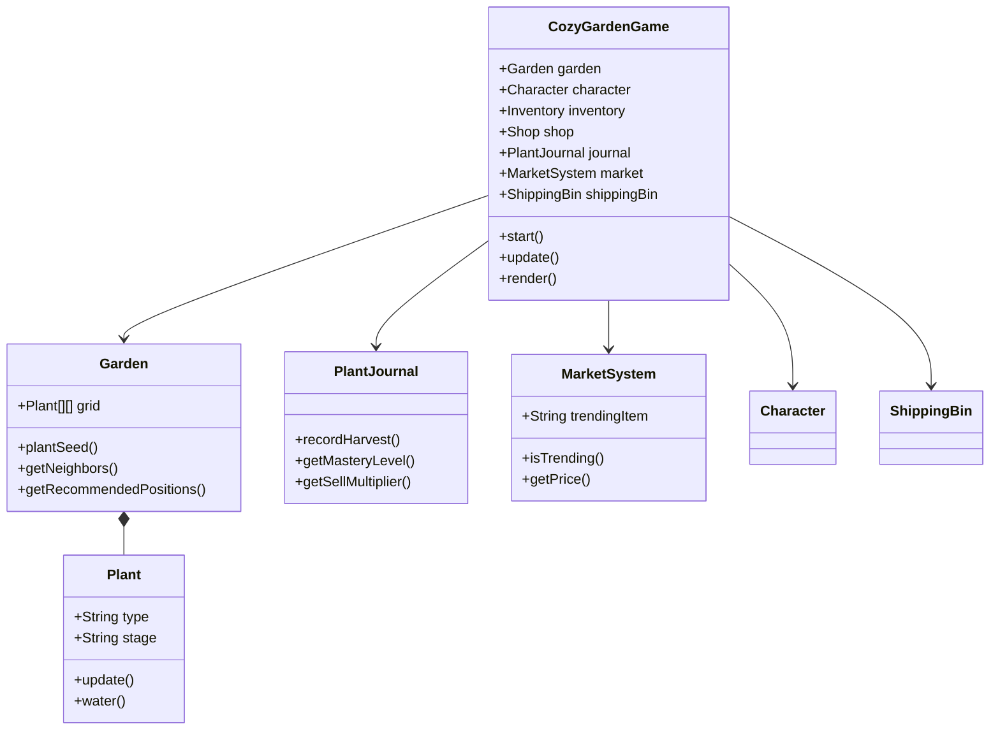

# 🌸 치유형 픽셀 아트 가드닝 시뮬레이션
## 게임 디자인 문서 (GDD) 요약본

---

## 1. 게임 개요

| 항목 | 설명 |
|------|------|
| **장르** | 샌드박스 가드닝 & 데코레이션 시뮬레이션 |
| **플랫폼** | 웹 브라우저 (HTML5/JavaScript) |
| **타겟 유저** | 스트레스 해소가 필요한 모든 연령대 |
| **세션 시간** | 5분 ~ 무제한 (언제든 중단 가능) |

### 핵심 철학 (The Three Pillars)

```
🚫 실패 없음 (No Fail States)
   → 식물은 절대 죽지 않습니다. 물을 주지 않으면 성장이 "일시 정지"됩니다.

🌿 풍요로움 (Abundance)  
   → 처벌이 아닌 보상만 존재합니다. 기다림은 항상 보상으로 이어집니다.

🏠 안전함 (Safety)
   → 플레이어에게 심리적 안정감과 편안함을 제공합니다.
```

---

## 2. 시각적 스타일 가이드

### 2.1 픽셀 아트 해상도
- **스프라이트 기본 해상도**: `32x32px`
- 16x16 대비 장점: 잎, 꽃잎의 곡선 표현이 자연스럽고 텍스처에 깊이감 부여

### 2.2 체리 블라썸 드림 팔레트 🌸

| 이름 | 색상 코드 | 용도 |
|------|-----------|------|
| 미니멀 로즈 | `#F2C8DD` | 꽃잎, 핑크 계열 식물 |
| 라임 아이스 | `#D3DB7F` | 잎사귀, 줄기 |
| 요정 스파클 | `#A5DBF8` | 물, 하이라이트 |
| 크림 피치 | `#FFECD2` | 배경, 따뜻한 톤 |
| 모카 브라운 | `#8B7355` | 흙, 나무 |
| 딥 얼쓰 | `#5D4E37` | 젖은 흙, 그림자 |

### 2.3 동적 조명 시스템

| 시간대 | 조명 효과 |
|--------|-----------|
| 새벽 (05:00-07:00) | 부드러운 핑크빛 안개 |
| 낮 (07:00-17:00) | 따뜻한 자연광 |
| 해질녘 (17:00-19:00) | 황금빛 오렌지 틴트 |
| 밤 (19:00-05:00) | 보라색 달빛, 반딧불 파티클 |

---

## 3. 게임플레이 메커니즘

### 3.1 식물 성장 상태 머신

```
[SEED] → [SPROUT] → [GROWING] → [BLOOMING] → [FULL_GROWN] → [READY_TO_HARVEST]
   │         │          │           │             │                │
   └─────────┴──────────┴───────────┴─────────────┘                │
                    물이 없으면 ↓                   수확 →  💰 판매!
                   [PAUSED] (일시정지)
                    물을 주면 ↑
```

### 3.2 캐릭터 조작 시스템

| 입력 | 동작 |
|------|------|
| WASD / 화살표 | 캐릭터 이동 |
| SPACE | 상호작용 (수확/물주기) |
| P | 자동 파종 모드 토글 |

- 부드러운 그리드 보간 이동
- 흙먼지 파티클 발자국
- 자동 파종: 걷는 동안 빈 타일에 자동 심기

### 3.3 경제 시스템

| 아이템 | 구매 가격 | 판매 가격 |
|--------|-----------|-----------|
| 토마토 | 10G | 25G |
| 해바라기 | 8G | 20G |
| 튤립 | 12G | 30G |
| 당근 | 6G | 15G |
| 바질 | 5G | 12G |

### 3.4 퍼머컬처 이웃 시스템

**콤패니언 플랜팅**: 특정 식물끼리 인접하면 보너스!

| 조합 | 보너스 효과 |
|------|-------------|
| 토마토 + 바질 | 성장 속도 +20% |
| 당근 + 파 | 둘 다 성장 +15% |
| 해바라기 + 모든 식물 | 주변 식물 행복도 +1 |

**이웃 감지 범위**: 인접 8칸 (Moore Neighborhood)

### 3.3 물주기 피드백 (Juiciness)

1. 물줄기 애니메이션 (파티클)
2. 흙 색상 변화: `#8B7355` → `#5D4E37`
3. 물방울 튀김 효과
4. 기분 좋은 "톡톡" 사운드

---

## 4. UX/UI 설계

### 4.1 배치 시스템

| 모드 | 설명 | 적합한 아이템 |
|------|------|---------------|
| **그리드 모드** | 32px 격자에 정확히 스냅 | 식물, 울타리, 타일 |
| **자유 배치 모드** | 픽셀 단위 자유 이동 | 장식품, 돌, 작은 소품 |

### 4.2 드래그 앤 드롭

- 드래그 시 아이템 오프셋: 손가락/커서 위 20px
- 드래그 중 Z-index: 최상위 (9999)
- 배치 가능 위치: 녹색 하이라이트
- 배치 불가 위치: 붉은색 X 표시

---

## 5. 오디오 설계

### 5.1 BGM (배경음악)
- **장르**: Lo-fi Hip Hop / Ambient
- **BPM**: 70-90 (느린 템포)
- **목적**: 알파파(8-12Hz) 뇌파 유도 → 이완 상태 촉진

### 5.2 ASMR 효과음

| 액션 | 효과음 |
|------|--------|
| 물주기 | 물 따르는 소리 (3초) |
| 가지치기 | 가위 싹둑 소리 |
| 식물 배치 | 부드러운 "퐁" 소리 |
| 성장 완료 | 작은 반짝임 차임벨 |

---

## 6. 기술 사양

```
캔버스 크기: 800x600px
그리드 셀: 32x32px
그리드 크기: 25x18 셀
프레임레이트: 60 FPS
렌더링: Canvas 2D API
```

---

*"정원은 인내심의 예술이자, 희망의 표현입니다."* 🌱

---

## 7. 시스템 아키텍처

### 7.1 파일 구조 (File Structure)

| 파일명 | 역할 | 주요 책임 |
|--------|------|-----------|
| `game.js` | **Main Entry** & **Controller** | 게임 루프, 전역 상태, 시스템 통합 |
| `Garden.js` | **Model** (Grid Logic) | 2D 배열 관리, 식물 배치, 이웃 보너스 계산 |
| `Character.js` | **Controller** (Player) | WASD 입력, 이동, 상호작용 |
| `Plant.js` | **Model** (Entity) | 식물 상태 머신, 성장 타이머 |
| `Inventory.js`| **Data** (Persistence) | 골드, 씨앗, 작물 관리, localStorage |
| `Shop.js` | **View** & **Logic** | 상점 UI, 구매/판매, Shift+클릭 |
| `DragDropSystem.js` | **Input Handler** | 드래그 앤 드롭, 퍼머컬처 시각화 |
| `JournalSystem.js` | **V3.0** | 식물 도감, 마스터리 레벨 (10/50/100) |
| `MutationManager.js` | **V3.0** | 변종 교배, 색상 혼합 테이블 |
| `RainCloudSystem.js` | **V3.0** | 보상형 광고 모킹, 비구름 효과 |
| `MarketSystem.js` | **V4.0** | 동적 시세, 🔥 인기 아이템 |
| `ShippingBin.js` | **V4.0** | 배송 상자, 일괄 판매, 정산 |

### 7.2 데이터 흐름 (Data Flow)

1. **초기화**: `game.js`가 모든 시스템 인스턴스를 생성
2. **입력 처리**: 키보드 → Character.js, 마우스 → DragDropSystem.js
3. **상태 갱신**: 매 프레임 garden.update(), 일일 정산 checkDailySettlement()
4. **저장**: localStorage를 사용해 30초마다 자동 저장

---

## 8. V3.0 신규 시스템

### 8.1 식물 도감 (Plant Journal)

| 마스터리 레벨 | 수확 횟수 | 보너스 |
|--------------|----------|--------|
| Lv.1 | 10회 | 판매가 +10% |
| Lv.2 | 50회 | 성장 속도 +20% |
| Lv.3 🌟 | 100회 | 변종 확률 2배 |

### 8.2 변종 교배 (Cross-Breeding)

| 조합 | 결과 | 확률 |
|------|------|------|
| 토마토 + 바질 | 황금 토마토 | 10% |
| 튤립 + 튤립 | 보라 튤립 | 10% |
| 해바라기 + 튤립 | 핑크 해바라기 | 8% |

### 8.3 보상형 광고 (Rain Cloud)

- 🏪 상점 → 🎬 광고 보기 클릭
- ☁️ 비구름 등장 + 30초간 모든 식물 물주기
- 🌈 무지개 피날레 효과

---

## 9. V4.0 경제 시스템

### 9.1 배송 상자 (Shipping Bin)

| 기능 | 설명 |
|------|------|
| 위치 | 정원 좌상단 (1, 1) |
| 상호작용 | SPACE 키 |
| 정산 시점 | 06:00 AM (게임 내) |

### 9.2 동적 시세 (Market System)

- 매일 무작위 🔥 인기 아이템 선정
- 판매 가격 **1.5배** 적용
- 토스트 알림으로 표시

### 9.3 편의 기능

| 기능 | 방법 |
|------|------|
| 전체 수량 거래 | **Shift + 클릭** |
| 작물 일괄 판매 | "모두 판매" 버튼 |
| 연속 물주기/수확 | 마우스 드래그 |

---

## 10. 주요 클래스 관계



---

*"정원은 인내심의 예술이자, 희망의 표현입니다."* 🌱
